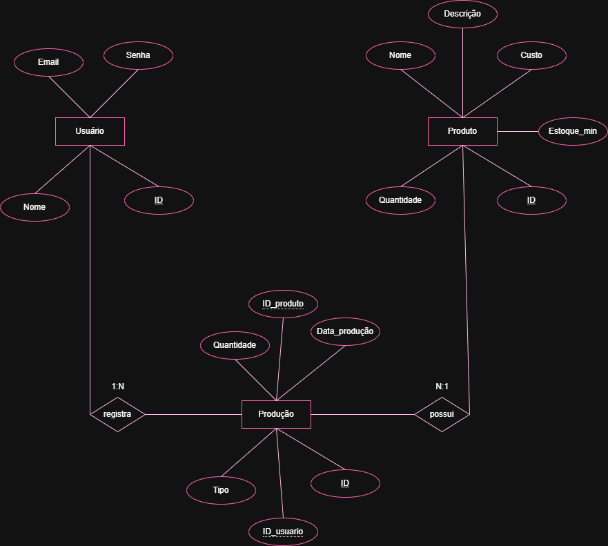

# Avaliação – Sistema de Gestão de Produção e Estoque

##  Sobre a atividade

Esta atividade tem como objetivo desenvolver um **sistema Web Full Stack** para gerenciar a produção e o estoque de produtos fabricados em MDF.

O sistema deverá permitir o cadastro e gerenciamento de produtos, controle de estoque, registro de pedidos e registro de produtos fabricados. A proposta utiliza o conceito de **Just in Time**, trabalhando com um estoque mínimo para evitar desperdícios e produzir de acordo com a demanda.

Além do desenvolvimento do sistema, a atividade contempla as etapas de **análise de requisitos, modelagem do banco de dados, implementação, testes e documentação**.

---

##  Objetivo

Desenvolver um sistema informatizado capaz de auxiliar um fabricante de produtos em MDF no controle de sua produção e estoque.

O sistema deverá possibilitar:

- Cadastro de produtos;
- Consulta, edição e exclusão de produtos;
- Controle da quantidade em estoque;
- Definição de estoque mínimo;
- Registro de produtos fabricados;
- Registro de pedidos e saídas de estoque;
- Identificação do usuário responsável por cada ação;
- Alertas quando o estoque estiver abaixo do mínimo;
- Acompanhamento das movimentações de produção e pedidos.

---

# 1. Lista de Requisitos Funcionais

## [RF01] Interface de Autenticação
- **[RF01.1]** Solicitar e-mail e senha do usuário.
- **[RF01.2]** Validar credenciais do usuário no banco de dados.
- **[RF01.3]** Redirecionar para a interface principal em caso de sucesso.
- **[RF01.4]** Informar o motivo da falha em caso de erro de autenticação.

---

## [RF02] Interface Principal do Sistema
- **[RF02.1]** Exibir nome do usuário logado.
- **[RF02.2]** Disponibilizar opção de logout, redirecionando para login.
- **[RF02.3]** Acessar interface de cadastro de produto.
- **[RF02.4]** Acessar interface de gestão de produção (*Just in Time*).

---

## [RF03] Cadastro de Produto
- **[RF03.1]** Listar produtos cadastrados em tabela ao carregar a interface.
- **[RF03.2]** Implementar campo de busca com atualização dinâmica da listagem.
- **[RF03.3]** Inserir novo produto no banco de dados.
- **[RF03.4]** Editar produto existente no banco de dados.
- **[RF03.5]** Excluir produto existente no banco de dados.
- **[RF03.6]** Validar dados inseridos (criação/edição) e exibir alertas em caso de erro.
- **[RF03.7]** Retornar para a interface principal.

---

## [RF04] Gestão de Produção (Just in Time)
- **[RF04.1]** Listar produtos cadastrados em ordem alfabética.
- **[RF04.2]** Selecionar produto para movimentação de estoque (pedido ou fabricado).
- **[RF04.3]** Inserir dados da movimentação (entrada ou saída).
- **[RF04.4]** Atualizar automaticamente a quantidade em estoque.
- **[RF04.5]** Emitir alerta em caso de estoque abaixo do mínimo configurado.

---

## [RF05] Registro de Ações do Usuário
- **[RF05.1]** Registrar qual usuário realizou cada ação (cadastro, edição, exclusão, movimentação de estoque).
- **[RF05.2]** Permitir consulta ao histórico de ações realizadas.
---

# 2. Diagrama Entidade-Relacionamento (DER)

O Diagrama Entidade-Relacionamento (DER) representa a estrutura do banco de dados do sistema, apresentando suas entidades, atributos, chaves primárias, chaves estrangeiras e relacionamentos.

### DER do sistema

---

# 3. Banco de Dados

O banco de dados utilizado no projeto foi desenvolvido com **MariaDB** e possui o nome:

`mdf`

Para realizar a comunicação entre o sistema e o banco de dados, foi utilizado o **Prisma ORM**.

O arquivo utilizado é:

- `schema.prisma` — responsável pela definição das tabelas, campos e relacionamentos do banco de dados.

Os dados utilizados no sistema foram inseridos diretamente no banco de dados MariaDB.
---

# 4. Interface de Autenticação

O sistema deverá possuir uma interface de login para autenticação dos usuários.

### Funcionalidades:

- Campo para informar o e-mail;
- Campo para informar a senha;
- Validação das credenciais;
- Mensagem informando o motivo da falha de autenticação;
- Redirecionamento para a tela principal após o login realizado com sucesso;
- Retorno à tela de login quando a autenticação falhar.

---

# 5. Interface Principal

A interface principal será responsável por centralizar o acesso às funcionalidades do sistema.

Ela deverá:

- Exibir o nome do usuário autenticado;
- Possuir uma opção de logout;
- Permitir acesso ao cadastro de produtos;
- Permitir acesso à gestão de produção;
- Possuir um layout organizado e adequado ao sistema.

---

# 6. Interface de Cadastro de Produto

A interface de cadastro de produtos deverá permitir o gerenciamento dos produtos armazenados no banco de dados.

Cada produto deverá possuir informações relacionadas ao seu gerenciamento, como:

- Nome;
- Descrição;
- Custo;
- Quantidade em estoque;
- Estoque mínimo.

### Funcionalidades:

- Listagem automática dos produtos;
- Exibição dos dados em uma tabela;
- Busca de produtos;
- Cadastro de novos produtos;
- Edição de produtos;
- Exclusão de produtos;
- Validação dos campos;
- Alertas para informações inválidas ou não preenchidas;
- Retorno à interface principal.

---

# 7. Interface de Gestão de Produção

A interface de gestão de produção será utilizada para controlar as movimentações do estoque.

Os produtos deverão ser apresentados em **ordem alfabética**, utilizando um algoritmo de ordenação.

O usuário deverá selecionar um produto e informar o tipo de movimentação:

### Fabricado

Representa uma entrada de produtos no estoque.

**Quantidade em estoque = quantidade atual + quantidade fabricada**

### Pedido

Representa uma saída de produtos do estoque.

**Quantidade em estoque = quantidade atual - quantidade solicitada**

Após cada movimentação, o sistema deverá verificar automaticamente se o estoque ficou abaixo do estoque mínimo configurado.

Caso isso aconteça, deverá ser exibido um **alerta ao usuário**.

Também deverá ser registrado qual usuário realizou a movimentação.

---

##  Documentação

Toda a documentação detalhada do sistema (requisitos, DER, casos de teste, infraestrutura) está disponível na pasta [docs](./docs).

#  Contextualização

Um fabricante local de produtos em MDF enfrenta dificuldades para controlar sua produção devido à ausência de um sistema informatizado.

Atualmente, os pedidos são realizados manualmente, podendo causar atrasos, erros na produção e dificuldades para acompanhar as demandas dos clientes e revendedores.

Para solucionar esses problemas, será desenvolvido um sistema de gerenciamento baseado no conceito de **Just in Time**, permitindo trabalhar com um estoque mínimo e produzir os produtos de acordo com a demanda.

O sistema permitirá centralizar as informações de produtos, pedidos, produção e estoque, tornando o processo mais organizado e facilitando o acompanhamento das movimentações realizadas.

---

# ✅ Lista de Verificação por Atividade

## ATIVIDADE 1 – Documentação de Requisitos
| Evidência | Capacidade | Peso | Sim | Não |
|-----------|------------|------|-----|-----|
| Desenvolveu conforme análise de requisitos | C6 | 2 | ✅ |  |
| Modelo de requisitos funcionais mínimos | C6 | 2 | ✅ |  |

## ATIVIDADE 2 – DER
| Evidência | Capacidade | Peso | Sim | Não |
|-----------|------------|------|-----|-----|
| Chaves estrangeiras conforme modelagem | C4 | 2 | ✅ |  |
| Relações 1:N entre tabelas | C4 | 2 | ✅ |  |
| Tipos definidos corretamente (DATE, INT, etc.) | C4 | 2 | ✅ |  |
| Entidades Usuário, Produto e Produção | C4 | 1 | ✅ |  |

## ATIVIDADE 3 – Script Banco de Dados
| Evidência | Capacidade | Peso | Sim | Não |
|-----------|------------|------|-----|-----|
| Criou banco com nome especificado | C4 | 1 | ✅ |  |
| Criou todas as tabelas com chaves estrangeiras | C4 | 2 | ✅ |  |
| Inseriu registros de teste | C4 | 2 | ✅ |  |

## ATIVIDADE 4 – Interface Autenticação de Usuário
| Evidência | Capacidade | Peso | Sim | Não |
|-----------|------------|------|-----|-----|
| Criou sessão/localStorage para usuário autenticado | C7 | 2 | ✅ |  |
| Redireciona para interface principal após login | C7 | 3 | ✅ |  |
| Campos de login, senha e botão entrar | C7 | 2 | ✅ |  |
| Tratamento de falha de autenticação | C7 | 3 | ✅ |  |

## ATIVIDADE 5 – Interface Principal
| Evidência | Capacidade | Peso | Sim | Não |
|-----------|------------|------|-----|-----|
| Acesso ao cadastro de produto | C7 | 1 | ✅ |  |
| Acesso à gestão de produção | C7 | 1 | ✅ |  |
| Logout redireciona para login | C7 | 1 | ✅ |  |
| Exibe nome do usuário autenticado | C7 | 2 | ✅ |  |

## ATIVIDADE 6 – Interface Cadastro de Produto
| Evidência | Capacidade | Peso | Sim | Não |
|-----------|------------|------|-----|-----|
| Lista produtos ao carregar | C7 | 2 | ✅ |  |
| Inserção de novo produto | C7 | 2 | ✅ |  |
| Edição de produto existente | C7 | 3 | ✅ |  |
| Exclusão de produto existente | C7 | 2 | ✅ |  |
| Validação de dados | C7 | 3 | ✅ |  |
| Retorno à interface principal | C7 | 1 | ✅ |  |
| Campo de busca funcional | C7 | 3 | ✅ |  |

## ATIVIDADE 7 – Interface Gestão de Produção (Just in Time)
| Evidência | Capacidade | Peso | Sim | Não |
|-----------|------------|------|-----|-----|
| Seleção de produto e tipo (entrada/saída) | C7 | 2 | ✅ |  |
| Inserção de dados de transferência | C7 | 3 | ✅ |  |
| Lista em ordem alfabética | C7 | 3 |  | ❌ |
| Alerta de estoque mínimo | C7 | 3 | ✅ |  |

## ATIVIDADE 8 – Casos de Testes
| Evidência | Capacidade | Peso | Sim | Não |
|-----------|------------|------|-----|-----|
| Ferramentas e ambiente de testes descritos | C8 | 2 | ✅ |  |
| Casos de teste por requisito funcional | C8 | 2 | ✅ |  |
| Testes executados conforme casos | C8 | 2 | ✅ |  |

## ATIVIDADE 9 – Documentação de Infraestrutura
| Evidência | Capacidade | Peso | Sim | Não |
|-----------|------------|------|-----|-----|
| Linguagem e versão identificadas | C1 | 1 | ✅ |  |
| SGBD e versão identificados | C1 | 1 | ✅ |  |
| Sistema operacional e versão identificados | C1 | 1 | ✅ |  |

#  Tecnologias

As tecnologias utilizadas no desenvolvimento deverão ser documentadas conforme o ambiente escolhido para o projeto.

- **Frontend:** HTML, CSS e JavaScript  
- **Backend:** Node.js e Express  
- **Banco de dados:** MariaDB  
- **ORM:** Prisma  
- **Testes de API:** Insomnia  
- **Navegador:** Google Chrome  
- **Editor de código:** Visual Studio Code

---

#  Objetivo da avaliação

A avaliação tem como objetivo verificar a capacidade técnica de **planejar, desenvolver, testar e documentar** um sistema de informação simples, aplicando boas práticas de desenvolvimento de software.

O projeto contempla as principais etapas do desenvolvimento de um sistema:

**Análise de requisitos → Modelagem → Desenvolvimento → Testes → Documentação**

